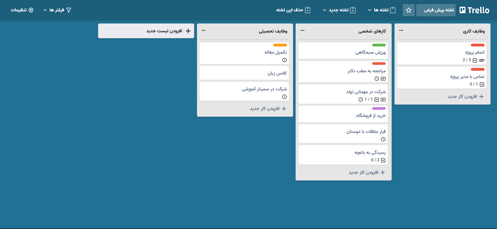
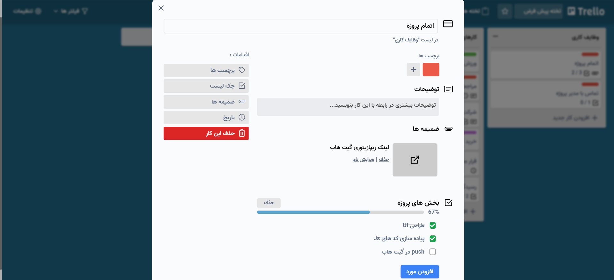

# Trello clone

an ultimate todo list inspired by [Trello](https://trello.com/).

[live demo](https://62f75608f5c5fc72ddc31362--marvelous-macaron-d55aac.netlify.app/).

---

## Description

The goal of this project was to create an todo list with advanced features, just like trello.this project created using react,redux,tailwind css and framer motion to boost UI/UX exprience.

## Features

- create/delete/rename board.
- create/delete/rename list.
- create/delete/rename task.
- add label,description,date,checklist and attachment to a task.
- preview task attachment.
- personalize app background color/image.

## Installation

`yarn add && yarn run start`

## Author

Mohammdad sina kazemi
